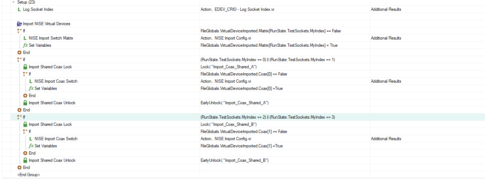
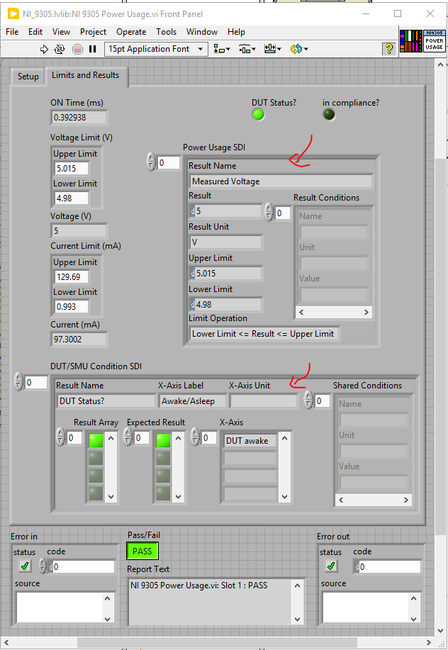

# NI9305 Code Review

**Reviewer:** (your name)
**Date:** 2026-06-15
**Subject:** TestStand Sequence — Setup Section

---

## Review #1 — Setup: Import NISE Virtual Devices

### Flow Description

1. **Log Socket Index** — Logs the current socket index before any import begins.
2. **Import Switch Matrix** — If not yet imported for this socket, calls NISE Import Config.vi and sets a flag to prevent re-importing.
3. **Import Coax Switch (Sockets 0 & 1)** — If socket index is 0 or 1, acquires lock `Shared_A`, imports the Coax config if not already done, then releases the lock.
4. **Import Coax Switch (Sockets 2 & 3)** — Same as above for socket index 2 or 3, using lock `Shared_B`.

### Recommendation

Add a comment to each step and group describing what it does at runtime, so the sequence is self-explanatory without tracing the logic.

---

---

## Review #2 — SDI Controls: Use `te-standard-data-types` Component

### Flow Description

All SDI controls in the sequence should reference the shared `te-standard-data-types` component rather than defining their own data types individually.

### Recommendation

Use the `te-standard-data-types` component for all SDI controls, and link each control directly to the component.

> **Note:** Apply this change to **all related VIs**, not just the one shown above.

Reference: [te-standard-data-types](https://dev.azure.com/ni/DevCentral/_git/te-hwtest?path=/source/common/data/te-standard-data-types)

---

<!-- Add next review below this line -->
