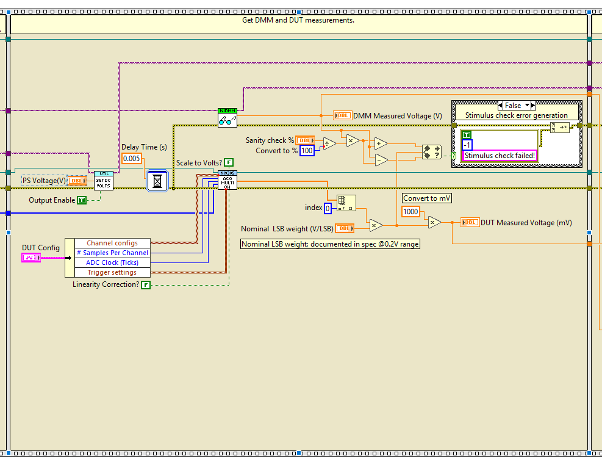
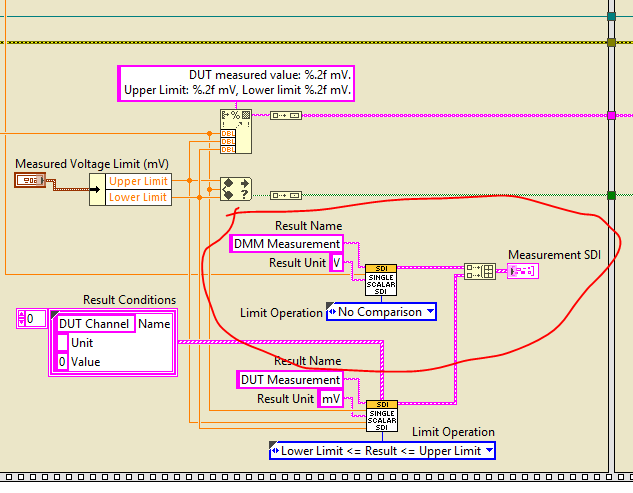
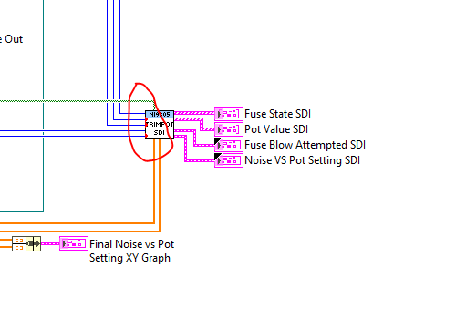
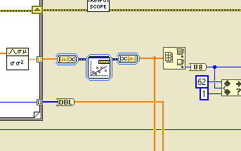
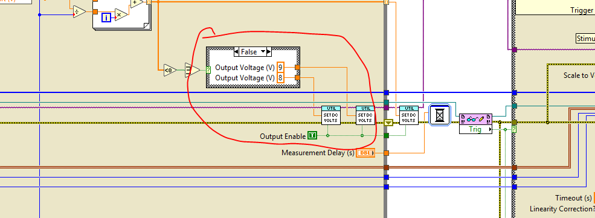
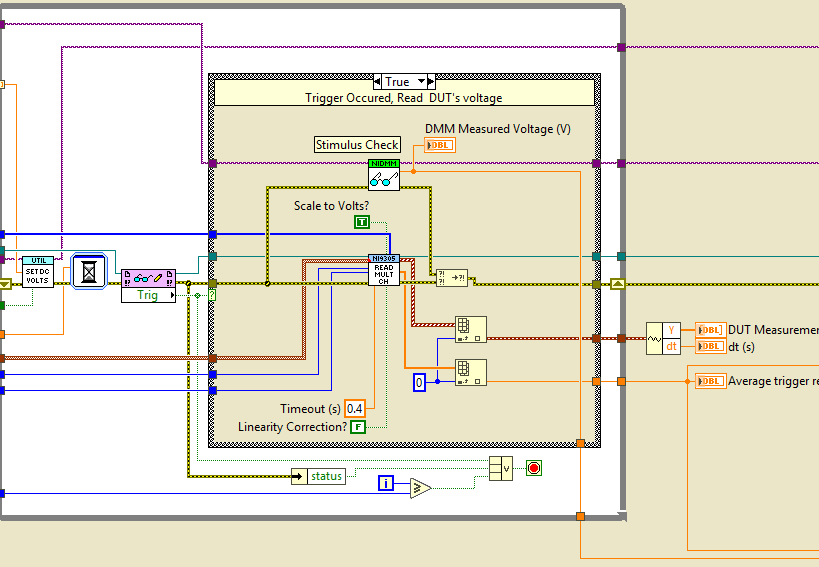
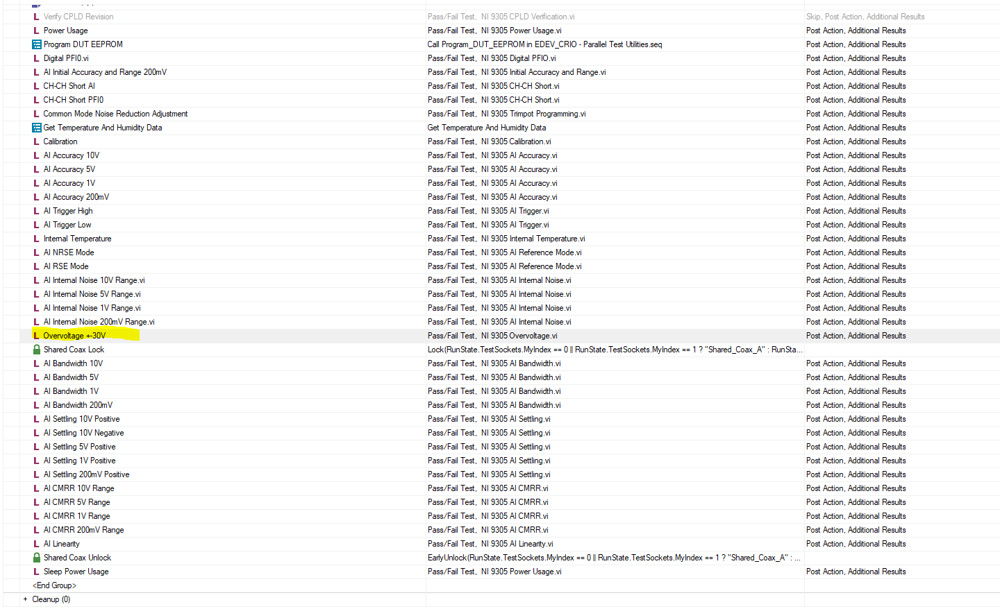

# NI9305 Code Review

**Reviewer:** (your name)
**Date:** 2026-06-15
**Subject:** TestStand Sequence — Setup Section

---

## Review #1 — Setup: Import NISE Virtual Devices

### Flow Description

1. **Log Socket Index** — Logs the current socket index before any import begins.
2. **Import Switch Matrix** — If not yet imported for this socket, calls NISE Import Config.vi and sets a flag to prevent re-importing.
3. **Import Coax Switch (Sockets 0 & 1)** — If socket index is 0 or 1, acquires lock `Shared_A`, imports the Coax config if not already done, then releases the lock.
4. **Import Coax Switch (Sockets 2 & 3)** — Same as above for socket index 2 or 3, using lock `Shared_B`.

### Recommendation

Add a comment to each step and group describing what it does at runtime, so the sequence is self-explanatory without tracing the logic.

---

---

## Review #2 — SDI Controls: Use `te-standard-data-types` Component

### Flow Description

All SDI controls in the sequence should reference the shared `te-standard-data-types` component rather than defining their own data types individually.

### Recommendation

Use the `te-standard-data-types` component for all SDI controls, and link each control directly to the component.

> **Note:** Apply this change to **all related VIs**, not just the one shown above.

Reference: [te-standard-data-types](https://dev.azure.com/ni/DevCentral/_git/te-hwtest?path=/source/common/data/te-standard-data-types)

---

## Review #3 — Digital PFI0

### Status: All good

No issues found with the Digital PFI0 configuration.

> **Note:** Double confirm the PWM threshold value with the HW engineer.

---

## Review #4 — Initial Accuracy and Range Test

### Flow Description

The VI acquires DMM and DUT measurements: it sets the PS voltage, waits for a delay, then triggers the NI9305 ADC acquisition. Afterwards, it performs a sanity check on the DMM reading and converts the DUT ADC output to millivolts using the nominal LSB weight.

### Current — Sanity Check Must Run Before the Actual Test

The sanity check (comparing the DMM measured voltage against the expected percentage range) currently runs **after** the NI9305 acquisition. Its error output (`Stimulus check failed!`) is not wired into the error line that feeds into the acquisition block.

**Recommendation:** Connect the sanity check error wire **upstream** of the NI9305 ADC acquisition node. This ensures the test aborts immediately if the stimulus is out of range, rather than proceeding with a bad measurement. All error terminals in this section should be chained in sequence — no dangling or parallel error lines.

---

## Review #5 — Initial Accuracy and Range Test (SDI)

### Recommendation

1. **DMM Measurement label** — Rename the SDI label from `DMM Measurement` to `DMM Measurement (Sanity Check)` to make its purpose explicit at a glance.
2. **Add test limits** — Add a test limit to the DMM Measurement (Sanity Check) SDI entry so the sanity check has a defined pass/fail boundary, rather than relying solely on the percentage check in the block diagram.

---

## Review #6 — CH-CH Short AI and PFI0 Test

### Status: Looks good ✓

No issues found. The CH-CH Short AI and PFI0 Test implementation is approved.

---

## Review #7 — TrimPOT Test

### Recommendation

Minimize coercion dots in the block diagram, especially on numeric inputs. Coercion dots indicate a data type mismatch and can cause unintended implicit conversions.

> **Note:** Check all other related VIs for the same issue and fix them as well.

---

## Review #8 — TrimPOT Test: Unconnected Error Terminals

### Recommendation

Ensure all sub-VI error terminals (both error in and error out) are connected and chained properly throughout the block diagram.

> **Note:** Check all other related VIs for the same issue and fix them as well.

---

## Review #9 — Trigger Test

### Question

Why is the voltage set to **8V** instead of **9V**? Please clarify the reasoning or update the value with a comment explaining the design decision.

---

## Review #10 — Trigger Test: Stimulus Check Purpose

### Question

What is the purpose of the **Stimulus Check** block in this section? Please add a comment on the block (or in the surrounding code) explaining what it validates and what happens if it fails.

### Recommendation

Move the **Stimulus Check** to run **before** the main acquisition/test logic. If the stimulus is invalid, the test should abort early rather than proceeding with a bad measurement.

---

## Review #11 — Overvoltage Test

### Question

Why is the Overvoltage Test placed in the middle of the test sequence?

### Recommendation

Move the **Overvoltage Test to the beginning of the test sequence**. As a protection/safety check, it should run first before any other tests to ensure the DUT is safe to proceed with further testing.
