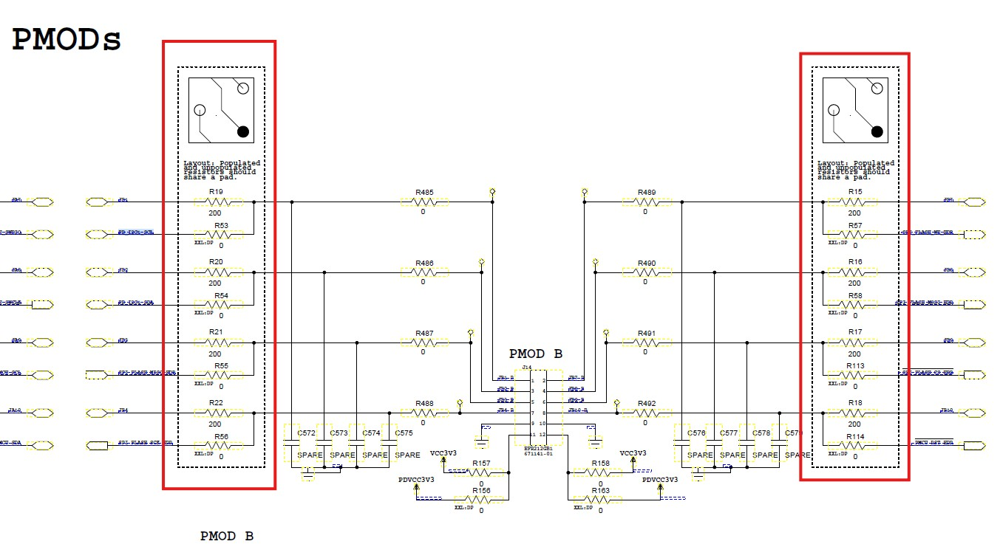
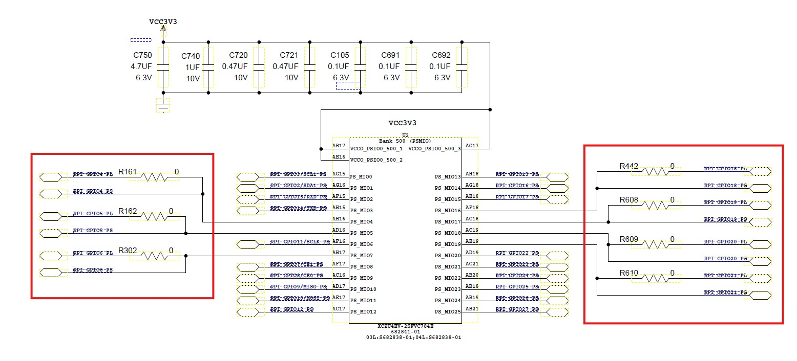
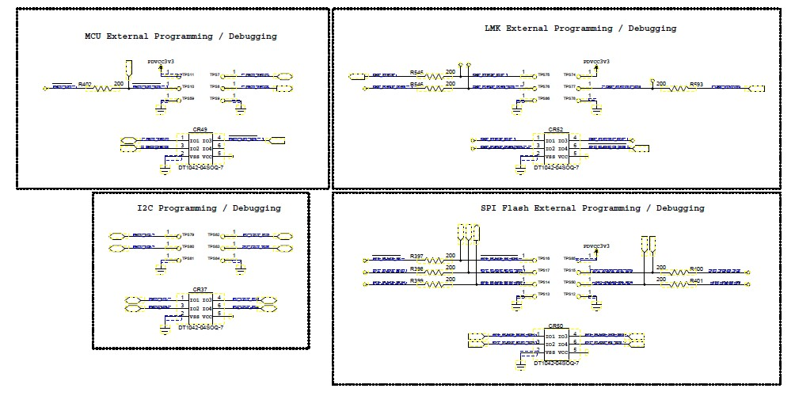

# Schematic Review — 8/10

## PMODs

### PMOD B (J14)

- **Question — Red-circled circuit:** I am not sure what the red-circled resistor circuits are intended to be used for. They appear to provide an alternate route to the MCU I2C and SPI.
  - **Please clarify:** What is the purpose of the alternate route to the MCU I2C?

## RPi HAT GPIO — PS/PL Shared Pins (U2, XCZU4EV)

- **Observation:** A few RPi HAT GPIO signals each have two nets — a `-PS` version and a `-PL` version — joined by a 0-ohm resistor (R161, R162, R302 on the left; R442, R608, R609, R610 on the right). From the schematic, these 0-ohm resistors are **populated**, so both the PS MIO pin and the PL pin are tied to the same HAT net simultaneously.
- **Why both PS and PL are connected:**
  - **Flexibility without a board spin** — the HAT GPIO can be serviced by either the PS (hardened MIO peripheral) or the PL fabric. Which side actually drives the pin is set in firmware / PL configuration, not by resistor population.
  - **Monitoring / loopback** — one side can be configured as an input (high-Z) to read the signal while the other side drives it.
  - **The 0-ohm still gives an option** — the connection can be cut later (de-populate) if contention or a routing conflict is found during bring-up.
- **Caution (contention risk):** Since PS MIO and PL share the same net, only **one side may be configured as an output/driver at a time**. If both are set as outputs, the result is bus contention (drive fight), risking damage or unreliable signaling. The pin-mux and PL constraints must guarantee one side is input while the other drives.
- **Please clarify:** For these shared pins, which side (PS or PL) is intended to be the driver, and is the firmware/PL configured to prevent both from driving simultaneously?

## External Programming / Debugging Access Points

There are four separate programming/debug access points, each targeting a different device. They are independent access points, not a single chained interface — use whichever corresponds to the device you need to program or debug.

| Block                                      | Connector | Target device                                     | When to use                                      |
| ------------------------------------------ | --------- | ------------------------------------------------- | ------------------------------------------------ |
| MCU External Programming / Debugging       | CR49      | Microcontroller                                   | Flash / debug the MCU firmware                   |
| LMK External Programming / Debugging       | CR52      | LMK clock chip (clock generator / jitter cleaner) | Load the LMK register / clock configuration      |
| I2C Programming / Debugging                | CR37      | Devices on the I2C bus (e.g., EEPROM / config)    | Program I2C-attached parts, read/write registers |
| SPI Flash External Programming / Debugging | CR60      | SPI flash memory                                  | Program the boot / config flash image            |

- **Do we use all four?**
  - **Production / full bring-up:** likely several are needed — e.g., SPI Flash (boot image) + MCU (firmware) + LMK (clock config) for a fully functional board.
  - **Specific task:** only the relevant one (e.g., updating the boot image → CR60 only; reflashing the MCU → CR49 only).
  - **I2C block** is typically for configuring I2C peripherals or an EEPROM, which may or may not be needed depending on the workflow.
- **Please clarify:** Which devices actually require programming in the manufacturing/test flow (MCU firmware, SPI boot flash, LMK clock config, I2C EEPROM), so we know which access points must be populated and used?
